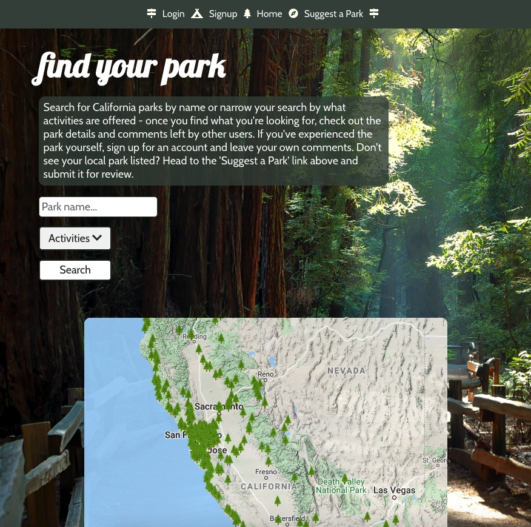
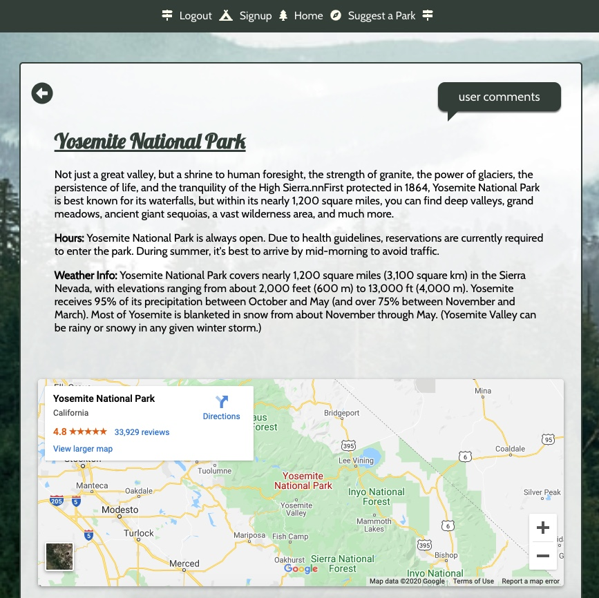
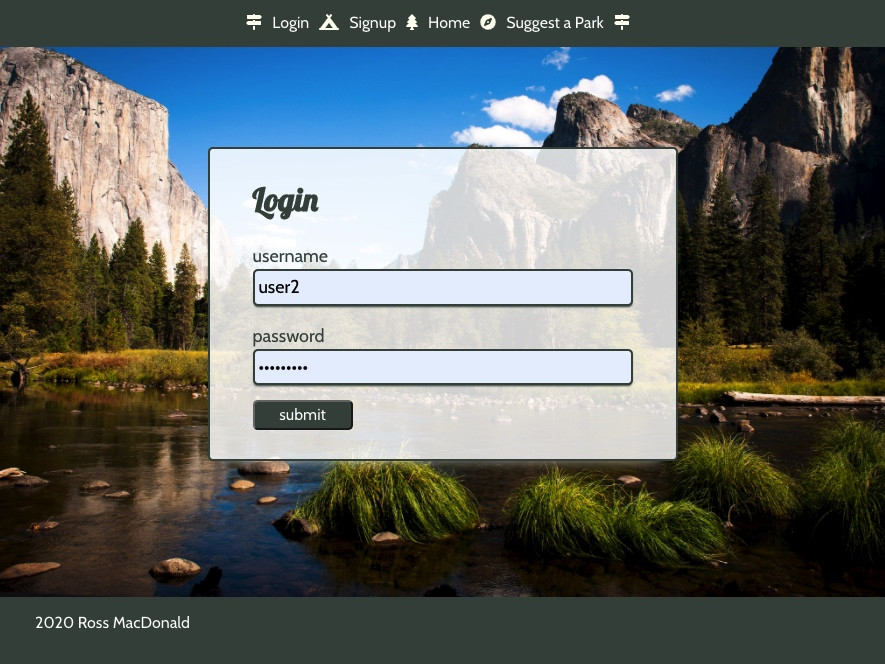
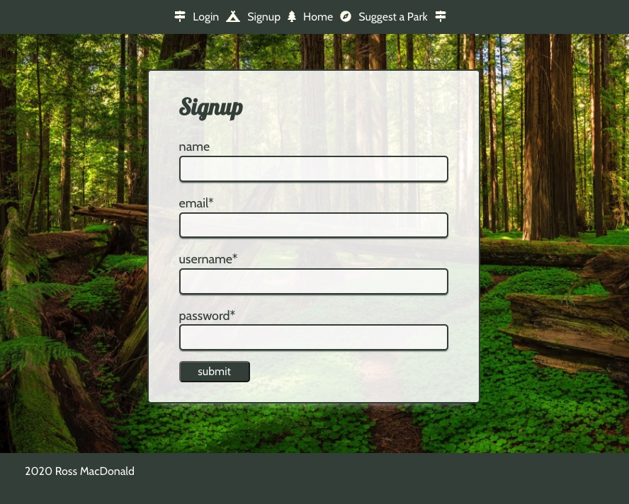
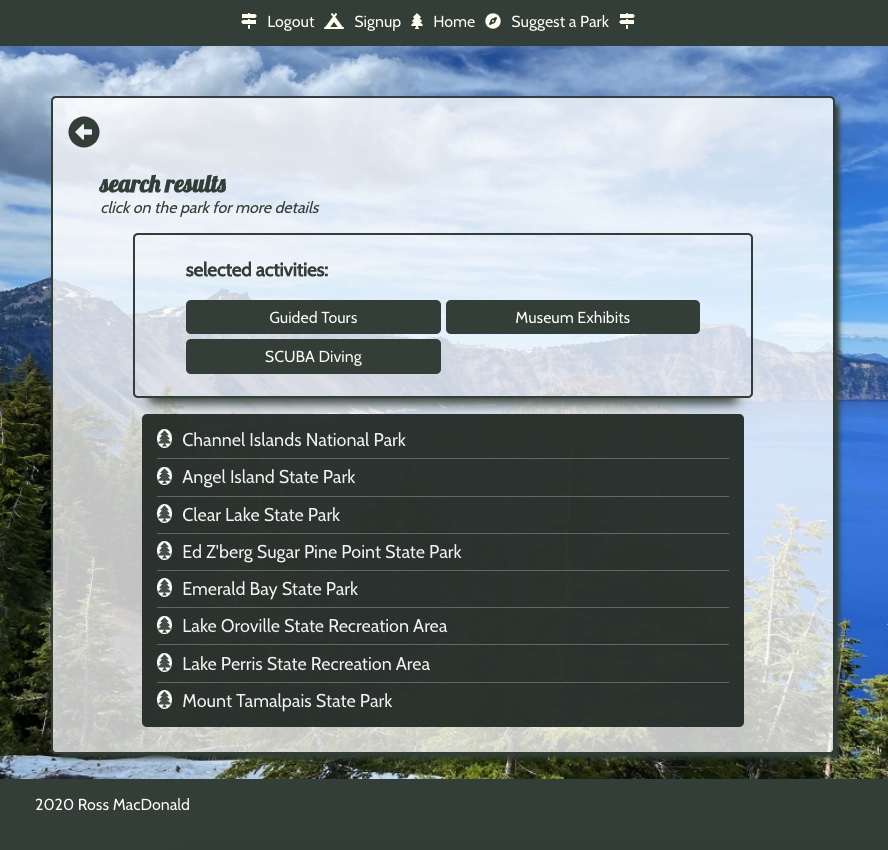
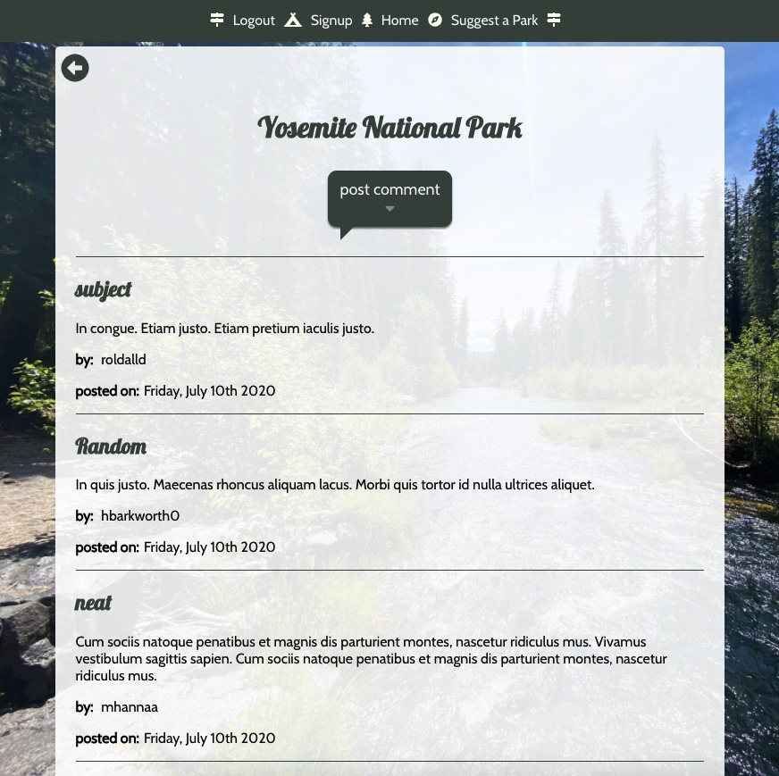

# Find Your Park 

[Live App](https://findyourpark.netlify.app/)

---
## Breakdown

Find Your Park is a web app designed to allow the user to find parks 
in California. Users can browse hundreds of California parks by location
via the built in map, or activities/park name using the search feature.
If a user wishes to read comments left by other users, leave a comment themselves, or suggest a park to add, they will need to sign up for an
account via the signup page and then login to the account. 

---

## API Documentation

### API Root 
https://glacial-lowlands-79872.herokuapp.com/api

A bearer token is required for use of the comments/suggestion API. The token can be acquired through registering with a username and password via the signup link on the navigation bar.

### API Endpoints

The API has multiple endpoints:
- /login
    The authentication endpoint called when the user attempts to login. Will authenticate
    username and password and either log the user in or provide 'incorrect username or password' response.
- /users
    Accepts POST request. The users endpoint is called when a new user is attempting registration. 
- /comments
    Accepts GET and POST requests. Comments endpoint is called when the user clicks on the 'user comments' button on a park page or attempts to post a comment to that park.
- /suggestions
    Accepts POST request. Suggestions endpoint is called when a user attempts to submit a 'suggest a park' form. 
- /data
    Accepts GET request. The data endpoint fetches data on all parks shown on the site.

---

## Screenshots

---

## Technologies

### Codebase
- [React](https://reactjs.org/)
- [Node.js](https://nodejs.org/en/)
- [PostgreSQL](https://www.postgresql.org/)
- [Express](https://expressjs.com/)
- [Knex](http://knexjs.org/)
- [JWT](https://jwt.io/)

### Test
- [Mocha](https://mochajs.org/)
- [Chai](https://www.chaijs.com/)
- [Supertest](https://www.npmjs.com/package/supertest)

### Deployment
- [Heroku](https://dashboard.heroku.com/)
- [GitHub(client)](https://github.com/rmac2289/parkfinder-app)
- [Github(api)](https://github.com/rmac2289/parkfinder-api)
- [Netlify](https://www.netlify.com/)

